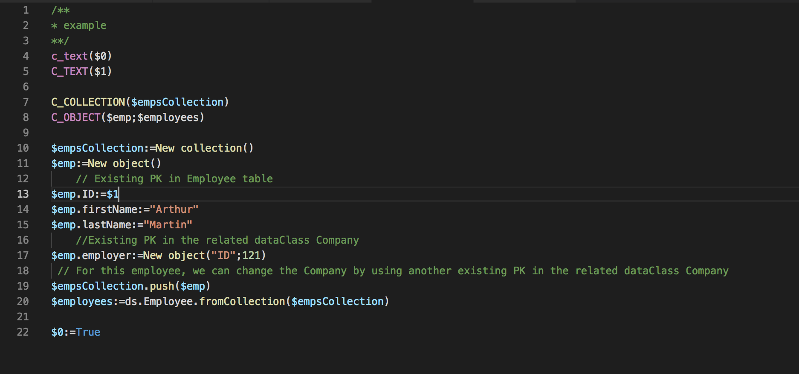

[](https://travis-ci.org/ayoubserti/lang-4d)
# lang-4d README

VSCode extension for 4D syntax highlighting.



## Install

In user home folder, you have an extensions folder under `.vscode`

```
> cd ~/.vscode/extensions
> git clone https://github.com/ayoubserti/lang-4d.git
```

Then reload VSCode.

It only apply to `.4dm` file.

**Enjoy**

